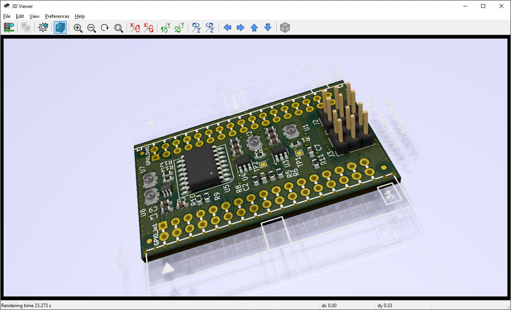

# iCE40 Signal Driver
Extension module for iCE40HX1K-EVB or iCE40HX8K-EVB.

Contains 
- variable delay IC and
- signal drivers and receivers for 50 Ohms UMCC cables.

License information should be found in LICENSE.txt

## Rendered PCB

